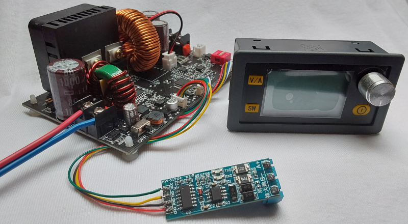

# XY6020L-Modbus
How to use the Modbus Interface of **XY6020L Digital Programmable Power Supply Module**  

Since I couldn't find any documentation on the net, I've compiled this [document](./doc/XY6020L-Modbus-Interface.pdf) with the necessary information to make use of the serial interface and Modbus protocol.  
The module is basically very similar to the DPS5020, but it has a extended Modbus register set, as it supports more features.  
The data sheet promises an input voltage range of up to 70V and an output capabilty up to **60V** and max. **20A**.

It can operate in headless mode (whithout operator panel) and is significantly cheaper than DPS5020.
Additionally it has a timer measuring the output 'on' time, and counters for cumulated mAh and mWh during an active output session.  
Thus the module would be an ideal candidate for battery charging or solarpanel tracking projects and experiments.  

Unfortunately I observed a severe **issue with the transition from CC to CV mode**.  
While battery charging, the module sometimes fails to lower the output current when battery reaches CV voltage level.  
Seems the regulator is somehow locked in CC mode while output (battery) voltage raises until OVP is triggered.  

This is imho a dangerous malfunction and I cannot recommend to use it for battery charging.  
You have been warned ...

[Here](./res/Wiring_400.png) is a detailed picture of the wiring to a Modbus adapter (HW-519).  
Of course, such an adapter is only requried for a real Modbus setup. The interface will also work on plain TTL level, e.g. to talk with an MCU.

